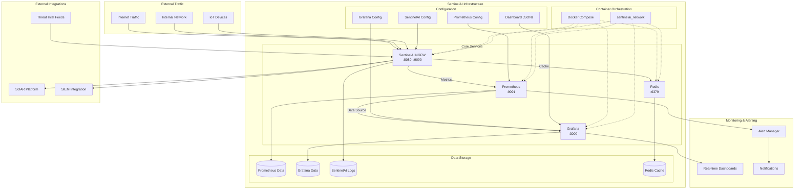
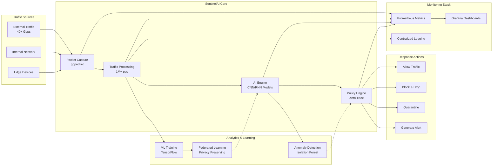
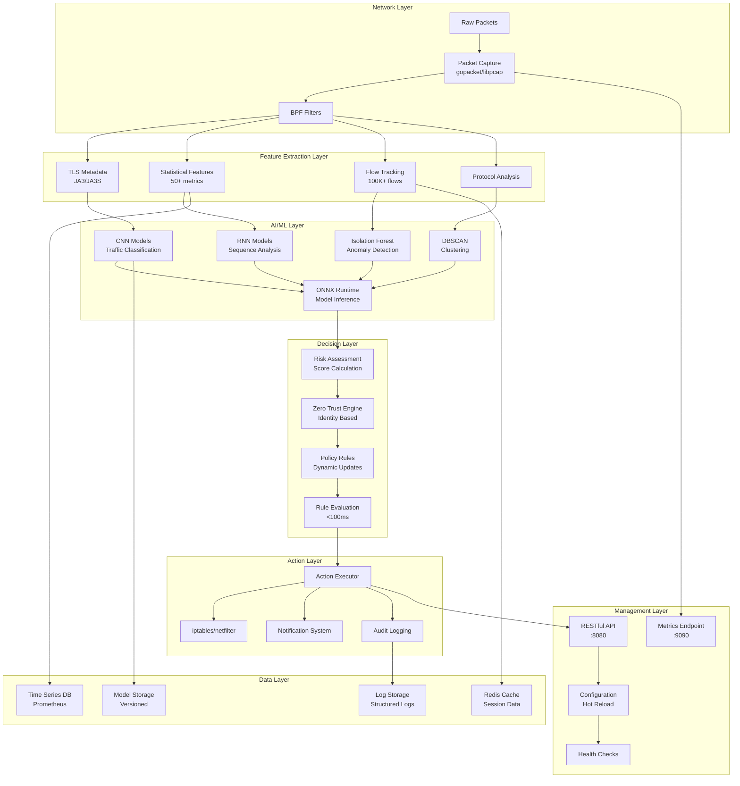
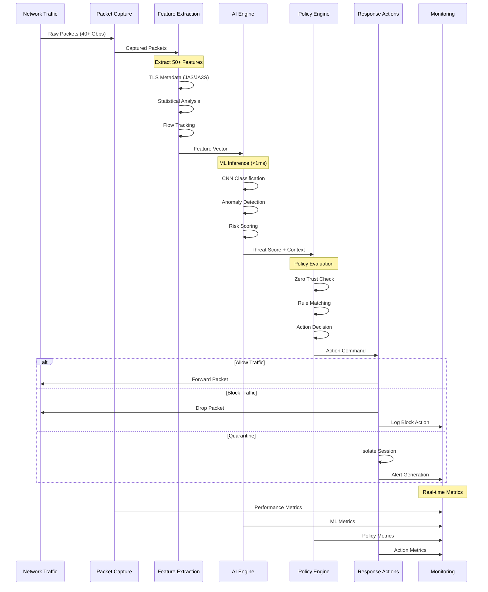
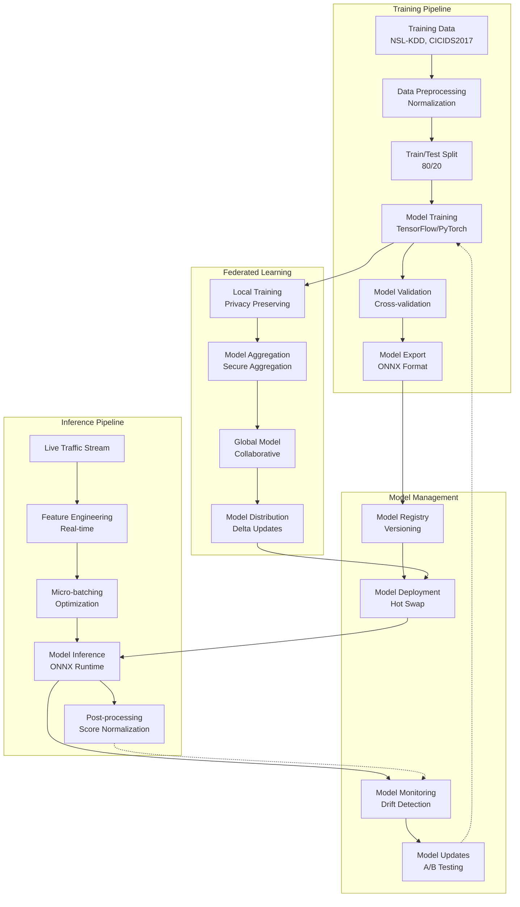
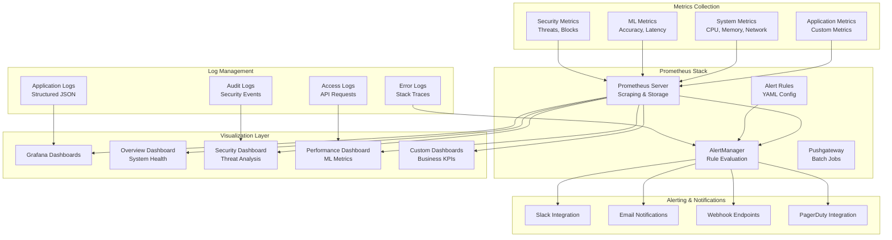
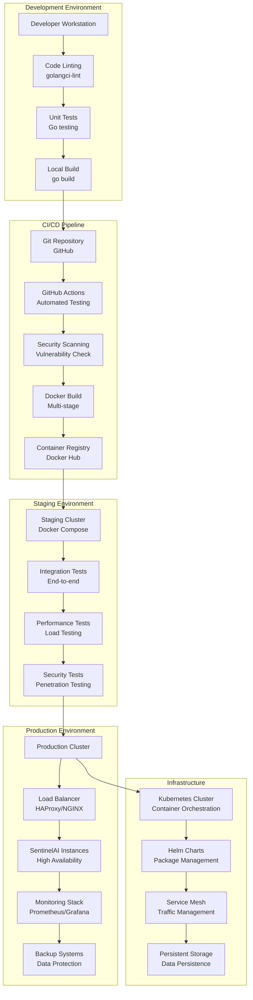
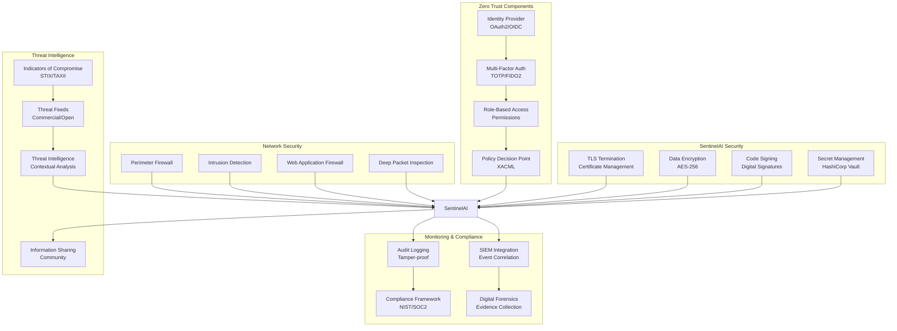
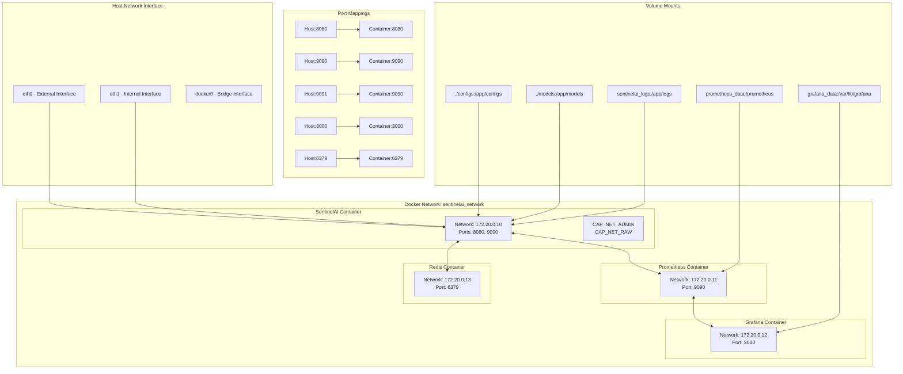

# SentinelAI Architecture Diagrams

This document contains comprehensive Mermaid diagrams for the SentinelAI infrastructure, architecture, and data flow.

## 1. Complete Infrastructure Overview

## 2. High-Level System Architecture

## 3. Detailed Component Architecture

## 4. Data Flow Architecture

## 5. ML Pipeline Architecture

## 6. Monitoring and Observability Architecture

## 7. Deployment Architecture

## 8. Security Architecture

## 9. Container Network Architecture

These comprehensive Mermaid diagrams provide detailed visualizations of your SentinelAI infrastructure from multiple perspectives, including overall architecture, component interactions, data flows, and deployment strategies. You can use these diagrams in documentation, presentations, or planning sessions.